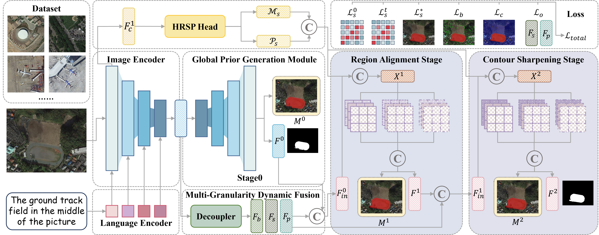

# HRAD

Official implementation of **"HRAD: Towards Region-Adaptive Disentanglement for Referring Remote Sensing Image Segmentation"**.

---

## Table of Contents

- [Contributions](#contributions)
- [RefOPT](#refopt)
- [Setting Up](#setting-up)
  - [Preliminaries](#preliminaries)
  - [Package Dependencies](#package-dependencies)
  - [Initialization Weights for Training](#initialization-weights-for-training)
  - [Training Dependencies (NLTK)](#training-dependencies-nltk)
- [Datasets](#datasets)
- [Training](#training)
- [Testing](#testing)

---

## 🚀Contributions

<figure align="center">
  
  <figcaption><em>Figure: Overall structure of HRAD.</em></figcaption>
</figure>

We introduce **RefOPT**, a new benchmark tailored for language-conditioned grounding and pixel-level delineation under challenging remote-sensing observations, and propose **HRAD**—a unified framework integrating **Global Prior Generation (GPG)**, **Progressive Feature Recursion (PFR)**, and hierarchical **Region-Adaptive Feature Disentanglement (RFD)**—to mitigate scale variation, regional heterogeneity, and partial observability, achieving consistent state-of-the-art performance across multiple datasets.

---

## 🧭RefOPT

RefOPT is a remote-sensing dataset for language-guided object localization/segmentation. Your local copy includes images, bounding boxes, English descriptions, and instance segmentation. In the folder, `images/` stores the raw images, `annotations/` contains XML annotations aligned with images, `annotations.txt` / `split/*.txt` provide `id + bbox + text description`, `mask_isat/` provides polygon segmentations, `mask/` provides mask images, and `instances.json` records metadata such as image sizes.

### 🖼️ Examples
<figure align="center">
  
  <figcaption><em>Figure: Qualitative examples / dataset samples .</em></figcaption>
</figure>

---

## 🗺️Setting Up RefOPT

RefOPT is a remote-sensing dataset for language-guided object localization/segmentation. Your local copy includes images, bounding boxes, English descriptions, and instance segmentation. In the folder, `images/` stores the raw images, `annotations/` contains XML annotations aligned with images, `annotations.txt` / `split/*.txt` provide `id + bbox + text description`, `mask_isat/` provides polygon segmentations, `mask/` provides mask images, and `instances.json` records metadata such as image sizes.

---

## ⚙️Setting Up

### Preliminaries
The code has been verified with **PyTorch v1.8.1** and **Python 3.8.19**.

1. Clone this repository  
2. Change directory to the repository root

### Package Dependencies
1. Create and activate the conda environment:
```bash
conda create -n HRAD python==3.8.19
conda activate HRAD
```

2. Install PyTorch v1.8.1 with a CUDA version that works on your machine (CUDA 11.1 in this example):
```bash
conda install pytorch==1.8.1+c111 torchvision==0.9.1+cu111 torchaudio==0.8.1 cudatoolkit=11.1 -c pytorch
```

3. Install remaining packages:
```bash
pip install -r requirements.txt
```

### Initialization Weights for Training
1. Create the directory to store pretrained weights:
```bash
mkdir ./pretrained_weights
```

2. Download the **pre-trained Swin Transformer** classification weights and put the `.pth` file into `./pretrained_weights/`:  [Swin Transformer](https://github.com/SwinTransformer/storage/releases/download/v1.0.0/swin_base_patch4_window12_384_22k.pth)
3. Download **BERT** weights and put them in the repository root:  [BERT](https://huggingface.co/google-bert/bert-base-uncased)
### Training Dependencies (NLTK)

#### NLTK is required
Training scripts rely on **NLTK** for basic text processing. If your environment cannot download NLTK data online, prepare the required **NLTK data resources** offline and place them in `NLTK_DATA`.

#### Direct download links
Download the following NLTK data packages:

- Punkt sentence tokenizer: [punkt](https://raw.githubusercontent.com/nltk/nltk_data/gh-pages/packages/tokenizers/punkt.zip)  
- Punkt tab data: [punkt_tab](https://raw.githubusercontent.com/nltk/nltk_data/gh-pages/packages/tokenizers/punkt_tab.zip)  
- English POS tagger: [tagger](https://raw.githubusercontent.com/nltk/nltk_data/gh-pages/packages/taggers/averaged_perceptron_tagger_eng.zip)  

#### Folder organization (minimal)
Extract the downloaded files into an NLTK data directory like below (no need to keep zip files):

```text
<nltk_data>/
├── taggers/
│   └── averaged_perceptron_tagger_eng/
└── tokenizers/
    ├── punkt/
    └── punkt_tab/
```

(Optional) set before training:
```bash
export NLTK_DATA=/path/to/<nltk_data>
```

---

## 🧬Datasets
We perform experiments on four datasets including [RefSegRS](https://github.com/zhu-xlab/rrsis), [RRSIS-D](https://github.com/Lsan2401/RMSIN), [RISBench](https://github.com/hit-sirs/crobim) and [RefOPT]().  

This repo uses a RefCOCO-style `REFER` loader. Please organize each dataset as:

```text
<data_root>/
├── RefSegRS/
│   ├── instances.json
│   ├── refs(unc).p
│   └── images/
├── RRSIS-D/
│   ├── instances.json
│   ├── refs(unc).p
│   └── images/
├── RISBench/
│   ├── instances.json
│   ├── refs(unc).p
│   └── images/
└── RefOPT/
    ├── instances.json
    ├── refs(unc).p
    └── images/
```

### Required Files
- `instances.json` (COCO instances format)
  - contains: `images`, `annotations`, `categories`
  - `annotations` must include `bbox` and `segmentation` (polygon or RLE)
- `refs(unc).p` (pickle list of referring instances)
  - each ref links to `image_id / ann_id / category_id`
  - includes `sentences` and `split` (e.g. `train/val/test...`)

### Consistency Check
- `images[*].file_name` must exist under `<data_root>/<dataset>/images/`
- every `ref.ann_id / ref.image_id / ref.category_id` must match an entry in `instances.json`

---

## 🧑‍💻Training
Edit `/path/to/HRAD/train.sh` to match your environment (dataset paths, pretrained weights, output directory, GPUs, and hyperparameters), then run:
```bash
bash /path/to/HRAD/train.sh
```

## 🧪Testing
Edit `/path/to/HRAD/test.sh` to match your environment (checkpoint path, dataset paths, pretrained weights, GPUs, and optional mask output), then run:
```bash
bash /path/to/HRAD/test.sh
```
